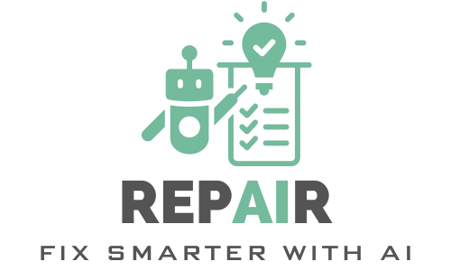

</img>


<h2 align="center"> The ultimate repAIr app </h2>
<h3 align="center"> Data Science & AI bootcamp capstone project </h3>
<h5 align="center"> neue fische GmbH - Jan 27 to Apr 24 2025 </h5>


## About the project
Welcome to our innovative repair application, designed to empower you to troubleshoot all your appliances and devices with ease. Whether you're dealing with a faulty washing machine or a temperamental smartphone, this app will will put the power of repair in your hands!

## Overview
In this project, you will be able to interact with our bot to:
* diagnose the issue of your device or appliance
* get a list of repair steps that you can query interactively to perform your repair
* if required, create a summary in a support ticket to get help from a professional

You can find an overview of this project in our [final presentation](./repAIr_presentation.pdf).
You can also test the bot in [Hugging Face](https://huggingface.co/spaces/UltimateRepAIr/RepAIr).

## Project structure description
<ul>
    <li><b>main.py</b> - The main file that runs the app.</li>
    <li><b>./ui</b> - where the code for user interface resides. Done with gradio.</li>
    <li><b>./chat_logic</b> - where the code for the chat resides.</li>
    <li><b>./rag</b> - where the code for the retrieval-augmented generation resides.</li>
    <li><b>./helper_functions</b> - where the code for cross-functional components resides.</li>
</ul>

## Getting started
### Set up your virtual environment
Clone the repo and set up your environment:

```
pyenv local 3.11.3
python -m venv .venv
source .venv/Scripts/activate
pip install --upgrade pip
pip install -r requirements.txt
```

### Configure your Groq API key
We use language models available in Groq. You will need an API key to run the app locally:
<ul>
    <li> Click <a href="https://console.groq.com/keys"> here </a> to create an API key.</li>
    <li> Add the API key in a .env file in your folder. (GROQ_API_KEY=&lt;your_key&gt;)
</ul>

### Start the app
```
python main.py
```

Et voilà! Enjoy!